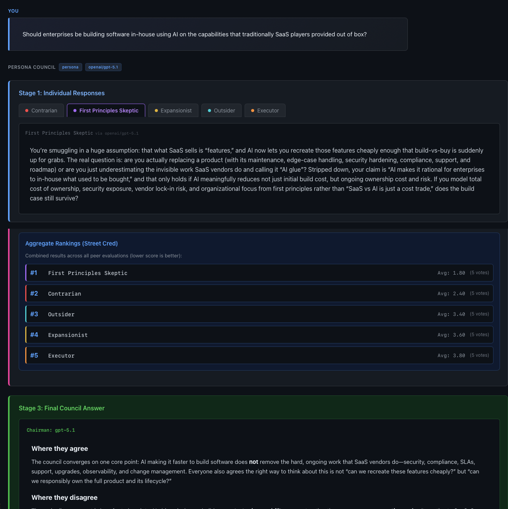

# Persona Council


A multi-persona council pattern for solo decision-making. Extended from Andrej Karpathy's [llm-council](https://github.com/karpathy/llm-council) with persona-bound prompting, direct provider support, and a UI for picking your model.

**Karpathy's original:** Send a query to multiple frontier models (GPT, Gemini, Claude, Grok via OpenRouter), have them review each other anonymously, and synthesize with a Chairman.

**This fork adds:** Persona-bound prompting so the same pattern works with a single LLM (no OpenRouter required), direct provider integration for Anthropic, OpenAI, and Gemini, a UI that picks your model from whichever API keys you've configured, and a dark theme. Plus a Claude Code slash-command version for users of [Claude Code](https://claude.com/claude-code).



*Five color-coded personas debate a decision, rank each other with identities anonymized, and the Chairman synthesizes a final call with a Monday-morning action.*

---

## Quick Start

```bash
git clone https://github.com/ghdna/persona-council.git
cd persona-council

# Backend dependencies
uv sync

# Frontend dependencies
cd frontend && npm install && cd ..

# Set one provider key (just pick one)
cp .env.example .env
# Edit .env: add ANTHROPIC_API_KEY, OPENAI_API_KEY, or GOOGLE_API_KEY

# Run both backend + frontend
./start.sh
```

Open <http://localhost:5173>. The UI shows a model dropdown populated from whichever provider keys you've set. Pick one, ask a decision-shaped question, watch the council deliberate.

---

## What's different from Karpathy's original

| Area | Karpathy's `llm-council` | This fork (`persona-council`) |
|---|---|---|
| **LLM access** | OpenRouter only (one key, all providers) | Direct Anthropic + OpenAI + Gemini APIs; OpenRouter as optional fallback |
| **Council members** | Different LLMs ranking each other (model diversity) | Configurable: different models, same model with different persona prompts (prompt diversity), or both |
| **Modes** | One (multi-LLM) | Three: `persona`, `model`, `hybrid` |
| **Model selection** | Hardcoded in `backend/config.py` | UI dropdown populated dynamically from configured API keys |
| **Mode selection** | N/A | UI dropdown per conversation |
| **Theme** | Light | Dark (GitHub-dark palette, color-coded personas) |
| **Claude Code skill** | N/A | Bundled in `claude-code-skill/` as a `/council` slash command |
| **Required signup** | OpenRouter account + credits | Just bring whatever provider key you already have |

---

## The five default personas

Each persona is a distinct lens. In the UI, each gets a colored dot in the persona tabs and a matching left-border on the Aggregate Rankings.

| Color | Persona | Lens |
|---|---|---|
| 🔴 Red | **The Contrarian** | Looks only at what will fail |
| 🟣 Purple | **The First-Principles Skeptic** | Rips your assumptions apart |
| 🟡 Amber | **The Expansionist** | Finds the upside you missed |
| 🔵 Cyan | **The Outsider** | Knows nothing about your industry |
| 🟠 Orange | **The Executor** | Cares only about Monday morning |

Plus **The Chairman** (green) who synthesizes the council and delivers a final call with a concrete Monday-morning action.

Personas are just markdown files in `personas/`. Edit them, add new ones (`legal-skeptic.md`, `cost-hawk.md`), or remove ones you don't use.

---

## Three modes

| Mode | What it does | Use case |
|---|---|---|
| `persona` (default) | One model, N personas. Each persona is a separate API call with its own system prompt. | Force multi-perspective using a single LLM you already pay for. |
| `model` | Karpathy's original. N different models, no personas. | Compare how different frontier models answer the same question. |
| `hybrid` | N different models, each with a persona prompt. Maximum diversity: model architecture AND persona lens. | When you have keys for multiple providers and want both axes of variety. |

Switch modes per conversation in the UI dropdown.

---

## How it works

Each query runs through a three-stage flow:

1. **Stage 1: First opinions.** Each council member answers the query independently. In `persona` mode, that means the same model called N times with N different system prompts (one per persona).
2. **Stage 2: Peer review.** Each member sees the other responses anonymized as `Response A`, `Response B`, etc. and ranks them on accuracy and insight. The label-to-member mapping is held in backend memory only — LLMs see only the anonymized labels. The frontend displays persona names for readability.
3. **Stage 3: Chairman synthesis.** The Chairman receives all responses and rankings (with names substituted in) and delivers the final answer: where the council agrees, where they disagree, the call, a Monday-morning action, and a confidence level.

> **Note on Stage 2 anonymization in `persona` mode.** Labels are removed from the prompt, but the underlying LLM can sometimes recognize its own writing *style* in one of the responses (since it wrote all N responses under different persona prompts on the same model). This is a fundamental limitation of single-LLM-multi-persona that Karpathy's original (different model architectures) avoids. Use `hybrid` mode for stronger isolation when this matters.

---

## What you'll see

The interface walks you through the three stages visually:

- **Your question** sits at the top with a blue left-accent border.
- **Stage 1: Individual Responses** (blue stage accent) shows five persona tabs, each with its colored dot. Click any tab to read that persona's take. The model name appears as a subtitle (`Contrarian via openai/gpt-5.1`).
- **Stage 2: Peer Rankings** (pink stage accent) shows how each persona ranked the others' responses with names substituted in. Below the tabs, the **Aggregate Rankings ("Street Cred")** block visualizes the consensus — the persona ranked best by the council appears at #1, with each row colored by its persona.
- **Stage 3: Final Council Answer** (green stage accent) shows the Chairman's structured synthesis with five sections: Where they agree, Where they disagree, The call, Monday morning action, and Confidence.

A **Council mode** dropdown (`persona` / `model` / `hybrid`) and a **Model** dropdown (populated from your configured API keys) sit above the input. Picks are per-conversation.

The whole interface is dark by default.

---

## Setup

### 1. Install dependencies

The project uses [uv](https://docs.astral.sh/uv/) for Python and `npm` for the frontend.

**Backend:**
```bash
uv sync
```

**Frontend:**
```bash
cd frontend
npm install
cd ..
```

### 2. Configure provider keys

Set at least **one** API key in your `.env` file. The UI shows models from whichever providers you've configured.

```bash
cp .env.example .env
# Edit .env. Set ONE OR MORE of:
ANTHROPIC_API_KEY=sk-ant-...      # https://console.anthropic.com/
OPENAI_API_KEY=sk-...             # https://platform.openai.com/api-keys
GOOGLE_API_KEY=...                # https://aistudio.google.com/apikey
OPENROUTER_API_KEY=sk-or-v1-...   # https://openrouter.ai/keys (optional)
```

**Just have one provider key?** Use `persona` mode (default). All five personas + the Chairman run on the single model you pick. You're billed only for that one provider.

**Want multi-LLM diversity?** Set keys for each provider you want, or use `OPENROUTER_API_KEY` as a single-key fallback for everything.

Models that currently require OpenRouter (no direct integration yet): `xai/grok-*`, `deepseek/*`.

### 3. Configure council (optional)

Most users don't need to touch this. The UI handles mode and model selection.

If you want to change what shows up in the model dropdown or adjust the multi-model defaults for `model`/`hybrid` modes, edit:
- `backend/main.py` → `PROVIDER_MODELS` controls dropdown options per provider
- `backend/config.py` → `COUNCIL_MODELS`, `PERSONA_MODEL_MAP` set defaults for non-`persona` modes

---

## Running the application

**Option 1: Use the start script**
```bash
./start.sh
```

**Option 2: Run manually**

Terminal 1 (backend):
```bash
uv run python -m backend.main
```

Terminal 2 (frontend):
```bash
cd frontend
npm run dev
```

Then open <http://localhost:5173>.

---

## Customization

| What | Where | How |
|---|---|---|
| **Add or edit personas** | `personas/*.md` | Each persona is a markdown file with a Lens, Instructions, and Format section. The list of active personas is in `backend/config.py` (`PERSONAS`). |
| **Change persona colors** | `frontend/src/components/Stage1.css` and `Stage2.css` | Search for `.tab.persona-<name>` and `.aggregate-item.persona-<name>`. Update hex colors. |
| **Change which models appear in the dropdown** | `backend/main.py` (`PROVIDER_MODELS`) | Add or remove model identifiers per provider. |
| **Default mode** | `.env` (`COUNCIL_MODE`) or `backend/config.py` (`MODE`) | `persona`, `model`, or `hybrid`. UI selection overrides this per conversation. |
| **Stage accent colors** | `Stage1.css` / `Stage2.css` / `Stage3.css` | Blue (`#58a6ff`), pink (`#ec4899`), green (`#3fb950`). |

---

## Claude Code Skill

If you use [Claude Code](https://claude.com/claude-code), there's a lightweight slash-command version in `claude-code-skill/`. The personas live at the repo root (shared with the web app) and are copied alongside the skill files:

```bash
cp -r claude-code-skill/.claude /path/to/your-workspace/
cp -r claude-code-skill/skills/council /path/to/your-workspace/skills/
cp -r personas /path/to/your-workspace/
```

Then type `/council <your decision>` inside any Claude Code session. See `claude-code-skill/README.md` for details.

---

## When to use the council

For decisions where being wrong has real cost:
- Career moves
- Strategic bets
- Drafts pre-publish (high-stakes audience)
- Architectural or technical calls
- Hiring or comp decisions
- Pricing or scoping calls
- Build vs buy decisions

Default Claude / GPT / Gemini is fine for chat questions and routine tasks. Use the council when the decision warrants the discipline.

---

## Project structure

```
persona-council/
├── personas/                       # Persona prompts (markdown)
│   ├── contrarian.md
│   ├── first-principles-skeptic.md
│   ├── expansionist.md
│   ├── outsider.md
│   ├── executor.md
│   └── chairman.md
├── backend/
│   ├── main.py                     # FastAPI app + /api/providers + message endpoints
│   ├── council.py                  # 3-stage orchestration
│   ├── config.py                   # Provider keys, defaults
│   ├── storage.py                  # JSON-based conversation storage
│   └── providers/                  # Provider router + per-provider clients
│       ├── router.py
│       ├── anthropic.py
│       ├── openai.py
│       ├── gemini.py
│       └── openrouter.py
├── frontend/
│   └── src/
│       ├── App.jsx                 # State, providers, mode/model dropdowns
│       ├── api.js
│       └── components/             # ChatInterface, Sidebar, Stage1/2/3
├── claude-code-skill/              # Slash-command variant for Claude Code
└── .env.example
```

---

## Tech stack

- **Backend:** FastAPI (Python 3.10+), async httpx. Direct integrations with Anthropic Messages API, OpenAI Chat Completions, and Google Gemini, plus OpenRouter as fallback.
- **Frontend:** React + Vite, react-markdown. Dark theme (GitHub-dark palette) with color-coded personas and stage accents.
- **Storage:** JSON files in `data/conversations/`.
- **Package management:** uv for Python, npm for JavaScript.

---

## Credits

Architecture extended from [Andrej Karpathy's llm-council](https://github.com/karpathy/llm-council). Persona-bound prompting, multi-provider routing, UI controls, and Claude Code skill by [Gary Arora](https://aroragary.com).

## License

MIT
